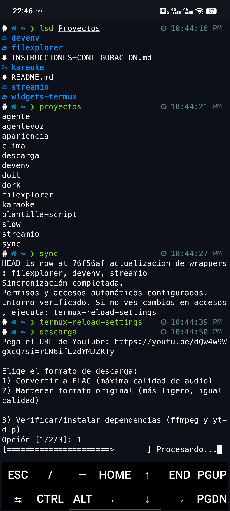

# Guía Rápida Widgets Termux

Este repositorio contiene scripts y utilidades para automatizar Termux en Android.

## Termux: descarga rápida y aviso

- Descarga desde F‑Droid: https://f-droid.org/en/packages/com.termux/
- APK directo (versión estable): https://f-droid.org/repo/com.termux_1022.apk

Termux es una terminal Linux para Android: es muy poderosa y puede modificar archivos del dispositivo. Úsalo bajo tu responsabilidad, haz respaldo de tus datos y revisa los scripts antes de ejecutarlos.

## Índice

- [Termux: descarga rápida y aviso](#termux-descarga-rápida-y-aviso)
- [Instalación y uso](#instalación-y-uso)
- [Uso Diario](#-uso-diario)
- [Proyectos del monorepo](#-proyectos-del-monorepo-qué-hace-cada-uno)
- [Scripts Incluidos](#-scripts-incluidos)
- [¿Qué es un wrapper?](#-qué-es-un-wrapper)
- [Personalización](#-personalización)
- [Servidores locales](#-servidores-locales-cómo-funcionan)
- [Capturas](#-capturas)
- [Solución de Problemas](#-solución-de-problemas)


## Instalación y uso 


1. Instala dependencias:
   ```bash
   pkg update && pkg install git termux-api python
   ```
2. Clona el repositorio completo:
  ```bash
  git clone https://github.com/MarioDiazRamos/Proyectos.git ~/Proyectos
  ```
3. Sincroniza y configura todo automáticamente:
  ```bash
  bash ~/Proyectos/widgets-termux/sync.sh
  ```
  Esto dará permisos en todo `~/Proyectos`, creará accesos y wrappers en `~/.shortcuts`, `~/bin` y también en `$PREFIX/bin` (para que funcionen de inmediato al escribir solo el nombre), añadirá `~/bin` al PATH y verificará dependencias básicas (sin forzar actualizaciones). Si `~/Proyectos` existe pero no es un repositorio git, se respalda automáticamente y se vuelve a clonar.

4. (Opcional) Ejecuta:
   ```bash
   termux-reload-settings
   ```
  para que los accesos aparezcan en el menú de Termux.

5. Ejecuta cualquier script desde la terminal, widgets o menú.

6. Si algún script requiere API key, sigue las instrucciones en pantalla la primera vez.


# Sincronizar y actualizar scripts
~/sync.sh

# Para ver scripts disponibles ejecuta desde cualquier parte 
proyectos

# Ejecutar scripts disponibles desde cualquier parte: 
descarga
karaoke
agente
dork
doit
clima
apariencia
slow
# ...y otros según el menú y accesos directos
```

## 🧩 Proyectos del monorepo (qué hace cada uno)

- `widgets-termux/` – Colección de utilidades y launchers para Termux Widgets.
  - `sync` – Sincroniza el repo y crea accesos (wrappers). Uso diario.
  - `proyectos` – Lista rápida de todos los comandos disponibles.
  - `descarga` – Descarga audio de YouTube; opcionalmente convierte a FLAC; agrega metadatos y miniatura.
  - `slow` – Cambia la velocidad de un video generando un nuevo archivo.
  - `clima` – Muestra clima actual con GPS y notificación (usa open‑meteo y termux‑api).
  - `agente` – Agente de IA (Gemini) que sugiere y ejecuta comandos simples de Termux.
  - `agentevoz` – Igual que agente, pero por voz (TTS/STT con termux‑api).
  - `apariencia` – Ajustes de terminal (alias, colores, utilidades como lsd y bat) de forma idempotente.

- `karaoke/` – Proyecto para crear videos finales combinando audio y video. Incluye un servidor local Flask (`server.py`) y un lanzador `karaoke.sh` que inicia/detiene el servidor y guarda logs en `karaoke/temp/`.

- `filexplorer/` – Explorador de archivos minimal por web. Servidor Flask (`server.py`) con assets en `static/` para navegar y realizar acciones básicas.

- `devenv/` – Entorno de demos para front/back locales. Servidor Python sencillo (Flask) con `static/` para prototipos rápidos.

- `streamio/` – Servidor local para reproducir/servir contenido multimedia con interfaz mínima (estático + endpoints sencillos).

## 🛠️ Scripts Incluidos

### `sync.sh`
- **Función**: Script principal de sincronización para Termux
- **Ubicación**: `~/sync.sh`
- **Uso**: `./sync.sh`
- **Características**:
  - Clona repositorio en primera ejecución
  - Actualiza con `git pull` en siguientes usos
  - Crea enlaces simbólicos automáticamente
  - Da permisos ejecutables
  - Detecta y limpia enlaces rotos
  - Muestra estadísticas de proceso

 

### `plantilla-script.sh`
- **Función**: Plantilla para crear nuevos scripts
- **Incluye**:
  - Estructura básica con colores
  - Funciones de utilidad comunes
  - Verificación de dependencias
  - Manejo de entrada de usuario
  - Sistema de notificaciones

## 🧷 ¿Qué es un wrapper?

Un "wrapper" es un enlace que te permite ejecutar un script solo escribiendo su nombre (sin extensión) desde cualquier carpeta.

- Se crean automáticamente con `sync` en tres lugares: `~/.shortcuts`, `~/bin` y `$PREFIX/bin`.
- Para archivos `.sh`, el nombre del comando es el nombre del archivo sin extensión (ej. `descarga.sh` -> `descarga`).
- Para archivos `.py`, usamos un pequeño `.sh` lanzador (por ejemplo `agente.sh` / `agentevoz.sh`) para asegurar el intérprete y las dependencias.
- Si se borra el script original, `sync` limpia los enlaces rotos para evitar comandos huérfanos.

## 🔧 Personalización

### Variables importantes

**En `sync.sh`:**
```bash
REPO_URL="https://github.com/MarioDiazRamos/Proyectos.git"
CARPETA_REPO="$HOME/Proyectos"
CARPETA_WIDGETS="$CARPETA_REPO/widgets-termux"
CARPETA_SHORTCUTS="$HOME/.shortcuts"
```


### Filtros de archivos

Los scripts excluyen automáticamente:
- `README.md`, `LICENSE`, `.gitignore`
- Archivos temporales (`.tmp`, `.log`)
- Carpeta `.git`
- Archivos de configuración (`configurar-*`, `instrucciones-*`)

## 🚨 Solución de Problemas

## 🌐 Servidores locales (cómo funcionan)

Varios proyectos (por ejemplo, `karaoke/`, `filexplorer/`, `devenv/`, `streamio/`) usan un patrón común:

- Backend ligero en Python (Flask) en `server.py`.
- Archivos estáticos en la carpeta `static/` (HTML/CSS/JS) servidos directamente.
- El servidor se inicia en `0.0.0.0` para permitir acceso desde la red local.
- Acceso típico: `http://127.0.0.1:<puerto>` en el propio teléfono, o `http://<IP_DEL_TELÉFONO>:<puerto>` desde otra máquina.
- Para obtener la IP del teléfono en Termux, puedes usar por ejemplo:
  ```bash
  ip route get 1 | awk '{print $7; exit}'
  ```
- Logs y PID suelen guardarse en `./temp/` dentro del proyecto cuando aplica.

## 📸 Capturas

<!--
Para no guardar imágenes en el repo, sube la captura a un Issue de GitHub (arrastrando el JPG al
editor del issue). Copia la URL "https://user-images.githubusercontent.com/...jpg" y reemplaza la URL
de abajo. Así el README mostrará la imagen sin agregar binarios al repositorio.
-->


### Widget no muestra scripts nuevos
```bash
# Verificar enlaces
ls -la ~/.shortcuts/

# Recrear enlaces
~/sync.sh

# Reiniciar widget o dispositivo
```

### Error de permisos SSH
```bash
# Regenerar claves SSH
ssh-keygen -t rsa -b 4096

# Verificar servidor SSH
ps aux | grep sshd
```

### Conflictos de Git
```bash
# Resetear cambios locales
cd ~/Proyectos
git reset --hard origin/main

# O hacer merge manual
git pull --no-ff
```

## 📈 Scripts de Ejemplo Incluidos

### `descarga.sh` - Descargador de YouTube
- Descarga música de YouTube en formato FLAC o original
- Incluye metadatos y miniaturas
- Organiza por álbum y número de pista

### `agente.py` - Agente con IA Gemini
- Convierte instrucciones en comandos ejecutables
- Filtros de seguridad incorporados
- Confirmación antes de ejecutar comandos

## 🤝 Cómo Contribuir

1. Fork el repositorio
2. Crea una rama para tu feature
3. Commit tus cambios
4. Push a la rama
5. Abre un Pull Request

---

**💡 Tip**: Usa la plantilla `plantilla-script.sh` para crear nuevos scripts con estructura consistente.

**⚠️ Importante**: Siempre haz backup de tus scripts importantes antes de experimentar.